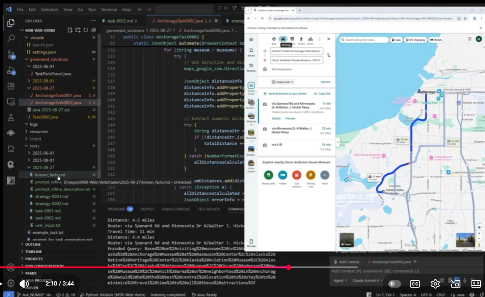

## Web verbs for NLWeb 

This repository contains **proof-of-concept demonstrations** to show a potential path for developers to build an agent-operable World Wide Web.  

Today, a user performs an operation on the web by making a web-API call or interacting with a sequence of HTML elements using a browser. Imagine that developers wrap these web APIs and browser interactions into functions (which we call "web verbs") and ingest these functions in NLWeb's vector database. This will pave a promising path toward a realistic agentic web because every user task becomes a coding task, which LLMs are very good at.

## A video demo
In the [demo](tasks/2025-08-27) below, we show a possible path to build and utilize NLWeb. The scenario is about planning a travel to Anchorage. You will see how the following vague task is concretized by the agent using real data on the web. The web verbs utilize NLWeb's natural language queries, browser automations, and web APIs.

<small>

```
My wife and I plan to fly to Anchorage on Tuesday of the next week, and come back to Seattle on Friday. In each full day there, we want to visit two museums. Please help us concretize this travel plan by finding a round trip flight and recommending good museums.

We need to find a hotel for all nights. Please suggest a list of options.

We would like to know the weather in Anchorage in the coming days, so that we can be better prepared. Also, please find a Youtube video for each of the museums.
```

</small>

<a href="https://www.youtube.com/watch?v=Y4TX5g5ulM4">

</a>

## The vision
We want to inspire developers to wrap the whole web as a gigantic set of web verbs. A similar industry-wide effort happened before -- the web used to be accessed by browsers only, but in the mobile computing revolution, the web was purposefully "wrapped" for mobile apps. Today, we wish the web to be operable by agents. Let's purposefully wrap it as web verbs.

The abstraction layer of web verbs utilizes the unique strength of programming language, e.g., precise function signatures and data types. Our examples show evidence that task compositions can be done effectively at this abstraction layer. Combining the strengths of programming language and vector database, web-scale composability becomes promising.    

## About this repository
Currently we have three early prototypes:

1. Our extension to NLWeb's db_load functionality. It ingests web verbs into the vector database. Please see [this instruction](verb_ingress/README.md). 
2. A set of 50 implemented verbs and a set of 100 tasks, each similar to the one shown above in [this short video](https://www.youtube.com/watch?v=ofbcKK8sMaA). The agent successfully composes the verbs to fulfill all the tasks. Please see [this instruction](verbs/README.md).
3. A tool for developers to wrap a browser-interaction sequence into a verb. (To be added to this repo later.)  


