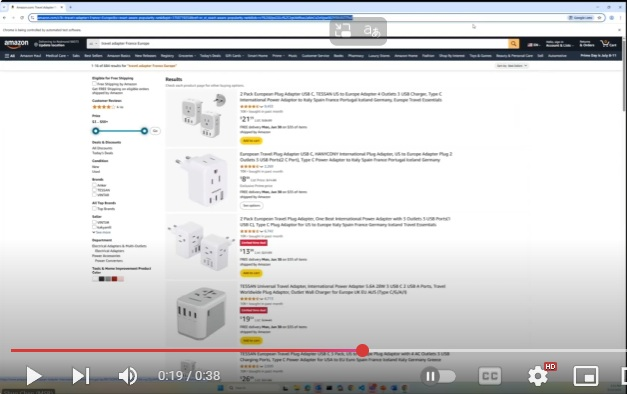

## Web verbs for NLWeb 

This repository contains **proof-of-concept demonstrations** to show a potential path for developers to build an agent-operable World Wide Web.  

Today, a user performs an operation on the web by making a web-API call or interacting with a sequence of HTML elements using a browser. Imagine that developers wrap these web APIs and browser interactions into functions (which we call "web verbs") and ingest these functions in NLWeb's vector database. This will pave a promising path toward a realistic agentic web because every user task becomes a coding task, which LLMs are very good at.

## A video demo
To show this vision, we have implemented 50 web verbs across various websites as Java functions. Using the agent mode in VS Code, we let the agent generate a solution according to the following description. The video shows the execution result.

<small>

```
Search for hotels in Paris on booking.com for the dates 2025-09-10 to 2025-09-15.  
Find a list of top-rated hotels.

Select the third cheapest hotel from the list, output its price and its hotel information. 

Find the distance to the Eiffel Tower: calculate the distance from the hotel's address to the Eiffel Tower.

Then, go to amazon.com and search for a travel adapter suitable for the country of the hotel’s address.  
Add the top-rated travel adapter to the Amazon shopping cart.  

Print the hotel name, distance to the Eiffel Tower, and the price of the travel adapter.

Also, send a Microsoft Teams message to john@foo.com that contains the printed information.
```
</small>

<a href="https://www.youtube.com/watch?v=ofbcKK8sMaA">

</a>

## The vision
We want to inspire developers to wrap the whole web as a gigantic set of web verbs. A similar industry-wide effort happened before -- the web used to be accessed by browsers only, but in the mobile computing revolution, the web was purposefully "wrapped" for mobile apps. Today, we wish the web to be operable by agents. Let's purposefully wrap it as web verbs.  

## About this repository
Currently we have three early prototypes:

1. Our extension to NLWeb's db_load functionality. It ingests web verbs into the vector database. Please see [this instruction](verb_ingress/README.md). 
2. A set of 50 implemented verbs and a set of 100 tasks, each similar to the one shown above in the video. The agent successfully composes the verbs to fulfill all the tasks. Please see [this instruction](verbs/README.md)
3. A tool for developers to wrap a browser-interaction sequence into a verb. (To be added to this repo later.)  


