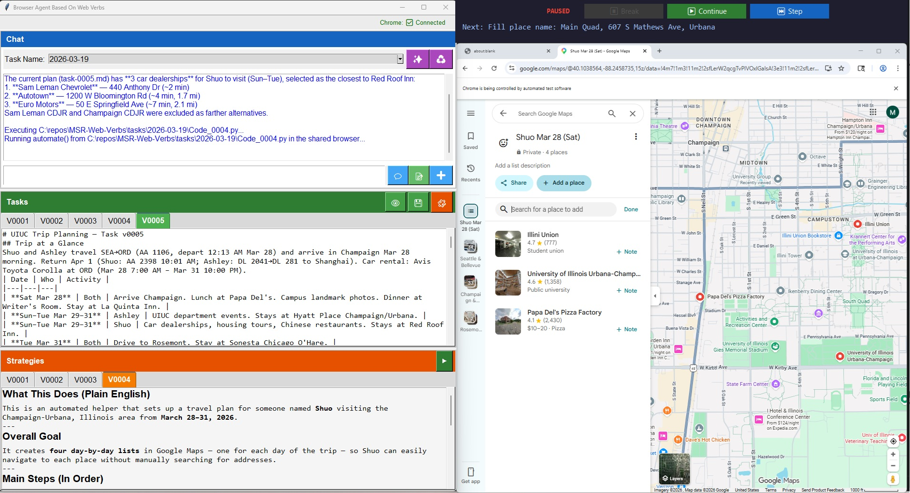
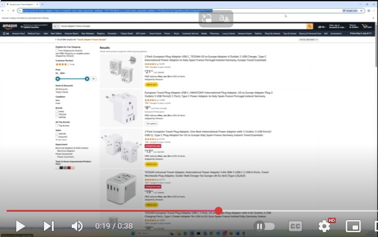

## Web Verbs for NLWeb 

Today, users operate the web by clicking buttons, filling forms, navigating pages, and reading results — all through a browser. Many existing browser agents try to automate these interactions by reasoning over raw HTML or screenshots at every step, which is costly, slow, and unreliable. **Web verbs** take a different approach: our goal in this initiative is to wrap browser interactions into typed Python functions with precise signatures and structured inputs/outputs, creating a gigantic programmable interface for browser agents. An agent no longer needs to interpret pixels or parse DOM trees — it simply calls functions.

Just as the semantic web envisioned every piece of data on the web as a structured entity, web verbs make every *action* on the web a structured entity. This makes the vision of web verbs a natural fit for [NLWeb](https://github.com/microsoft/NLWeb) — where data entities are discoverable by natural language, action entities can be too. An agent can discover relevant verbs, compose them into code, and fulfill complex multi-step tasks. Every user request becomes a coding task, and coding is exactly what LLMs are great at.

The key insight: **web verbs can be generated automatically.** We have produced **600+ web verbs** in total using our [automatic verb generation](https://github.com/cs0317/stagehand/) project, which generates typed Playwright functions from a few natural language sentences describing the browser interaction. The `verbs/` folder contains ~50 of these as a representative demo; the remaining verbs are organized across the `verbs-*` folders (e.g., `verbs-batch1/`, `verbs-batch2/`, etc.). Every verb can be run independently. This means wrapping the entire web is not a manual effort — it can scale with AI. **If you use a website regularly, you can contribute a web verb for it today.**

## About this repository

### 1. Web Verb Library (`verbs/` and `verbs-*/`)
The full library contains **600+ web verbs** covering major websites across travel, shopping, finance, maps, media, and more — all **automatically generated** from natural language descriptions. The `verbs/` folder holds ~50 verbs as a representative demo, while the rest are organized across the `verbs-*` folders (e.g., `verbs-batch1/` through `verbs-batch9/`, `verbs-GoogleDocs-batch/`, etc.). Each verb is a standalone Python function with a typed signature (dataclass request/response) that automates browser interactions via Playwright against a real Chrome profile. Every verb can be run independently. Examples include searching for Uber ride prices, booking flights on United, looking up Amazon products, and getting Google Maps directions. 

### 2. The App (`UI/`)
A desktop application that ties everything together. Given a natural language task, the agent:
1. **Refines** the vague task description into a concrete, actionable plan.
2. **Generates a strategy** — which verbs to use and in what order.
3. **Produces executable code** that composes verbs to fulfill the task.
4. **Runs the code** in a live Chrome browser.

The screenshot below shows the UI planning a trip to Champaign-Urbana, IL. The agent has refined the task through 5 versions and generated 4 strategies. On the right, Chrome is being automated to create day-by-day Google Maps lists with places to visit:



## Getting started

This project requires [Playwright](https://playwright.dev/python/) and [GitHub Copilot CLI](https://docs.github.com/en/copilot/concepts/agents/copilot-cli/about-copilot-cli). Install dependencies with:

```
pip install -r requirements.txt
gh extension install github/gh-copilot
```

From the `UI` directory, run:

```
python app.py
```

> **Note:** Some verbs require signed-in sessions (e.g., Uber, airline sites). The app launches Chrome with a persistent profile. On first launch, sign in to the websites you need, then close and restart the app. Your sessions will be preserved for subsequent runs. (We will make this process smoother later.) 

## An earlier video demo (January 2026)
The recording below is from an earlier version of the project. The scenario is about planning a travel to Anchorage. The agent takes a vague request and concretizes it by composing web verbs — searching flights, finding hotels, checking weather, discovering museums, and looking up YouTube videos — all from real websites.

This demo won first place in the "Agentic Web" track at Microsoft Global Hackathon 2025.
<small>

```
My wife and I plan to fly to Anchorage on Tuesday of the next week, and come back to Seattle on Friday. In each full day there, we want to visit two museums. Please help us concretize this travel plan by finding a round trip flight and recommending good museums.

We need to find a hotel for all nights. Please suggest a list of options.

We would like to know the weather in Anchorage in the coming days, so that we can be better prepared. Also, please find a Youtube video for each of the museums.
```

</small>

<a href="https://www.youtube.com/watch?v=g3GjpY1c6Rw">

</a>


