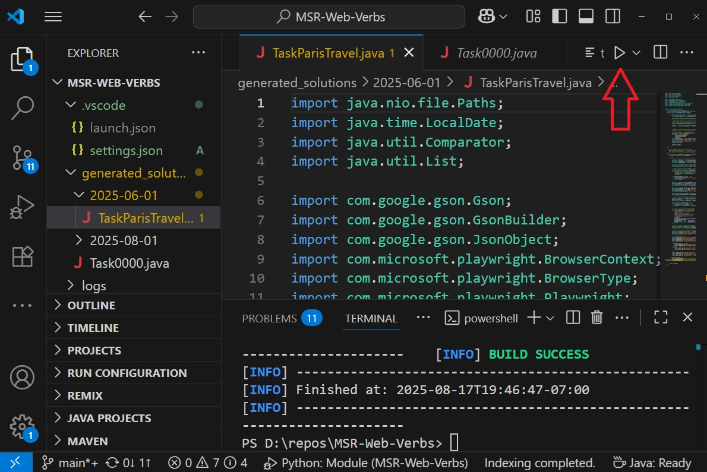
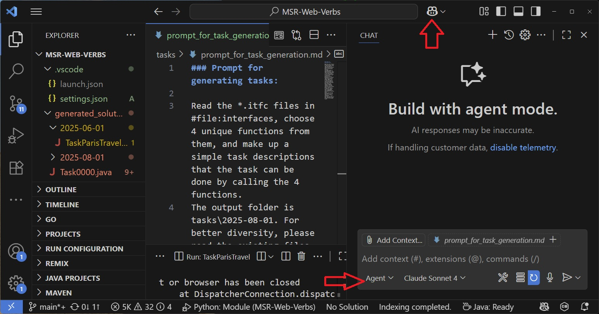

## Web verbs 

This document describes (1) how to run the existing solutions that are composed by the existing verbs, (2) how to generate new tasks and their solutions that are composed by the existing verbs, (3) how to generate new verbs.

### How to run the existing solutions

1. Install Visual Studio Code (VS Code) from [here](https://code.visualstudio.com/download).

2. Install Oracle JDK from [here](https://www.oracle.com/java/technologies/downloads/#jdk24-windows).

3. In VS Code, go to the Extensions view (Ctrl+Shift+X). Search for and install "Extension Pack for Java (by Microsoft)".

4. Open the root folder in VS Code. Wait for the loading to be completed.
5. In the terminal windows, type
   ```sh
   mvn compile
   ```
   
6. Select any Java file in the folder "generated_solutions". Click the run button to run it. See the screenshot below. These Java files are the solutions corresponding to the task descriptions in the "tasks" folder.
   
   

Alternatively, use the following command to run Taskxxxx.java.
```sh
mvn exec:java "-Dexec.mainClass=Taskxxxx"
```

7. Nasa, NewsAPI, OpenLibrary, OpenWeather, Spotify and Wikimedia are implemented by calling web APIs. If you want them to return actual data, you need to obtain their (free) API keys, follow [this instruction](./tests/README.md).
   
### How to generate new tasks and their solutions that are composed by the existing verbs

1. Open the Copilot pane and set it to the Agent mode. See the screenshot below.


2. Open [the file for task generation](../tasks/prompt_for_task_generation.md). Modify it as you wish. Paste the prompt into the Copilot input box. Click the Send button.
   
3. Once the tasks are generated, you can generate solutions for them. Use this file as [an example for solution generation](../tasks/2025-08-01/prompts.md).

4. Once the solutions are generated, use the steps described earlier to run them.

### How to generate new verbs.

To be described later.

